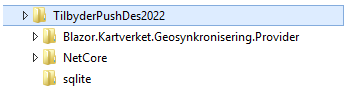
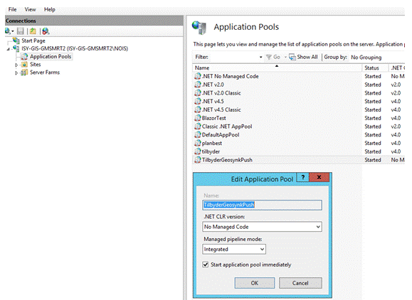
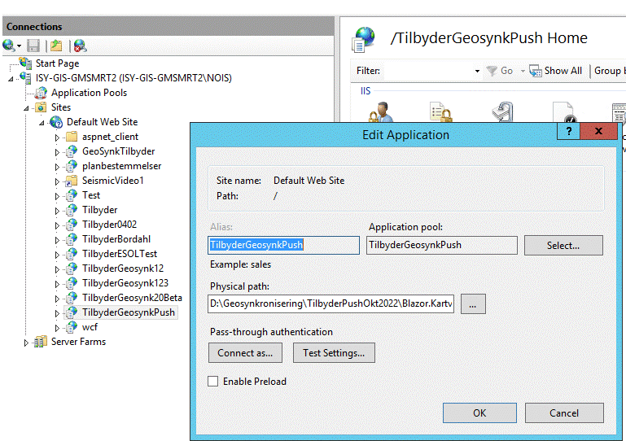

____________________________________________

**Installasjon av tilbyder**

Det anbefales at Web-pusher og Kommando-basert pusher bruker sqlite database.
Det beste er å legge opp en slik struktur der man legger geosync.sqlite på en egen mappe, sqlite: 

Man kan angi direkte path til sqlite base ved å legge det inn i config-filene. 
Fra: 
`"connectionStrings": {
    "geosyncEntities": "Data Source=|DataDirectory|geosync.sqlite;Mode=ReadWriteCreate"
  },` 
Til f.eks:  
`"connectionStrings": {
    "geosyncEntities": "Data Source="geosyncEntities": "Data Source=D:\\Geosynkronisering\\TilbyderPushDes2022\\sqlite\\geosync.sqlite;Mode=ReadWriteCreate"Mode=ReadWriteCreate"
  },`

Config-fil WEB: appsettings.json 
Config-fil .NET core: appsettings.json

____________________________________________

**Installere Web tilbyder i IIS:**

Installer .Net core hosting bundle på serveren først. 
For .NET 6: https://dotnet.microsoft.com/en-us/download/dotnet

I Application Pools: 

Under site:

Advanced settings:

**For Kommando-basert pusher:**

Dersom det er problem med å kjøre, installer:
https://dotnet.microsoft.com/download/dotnet/5.0